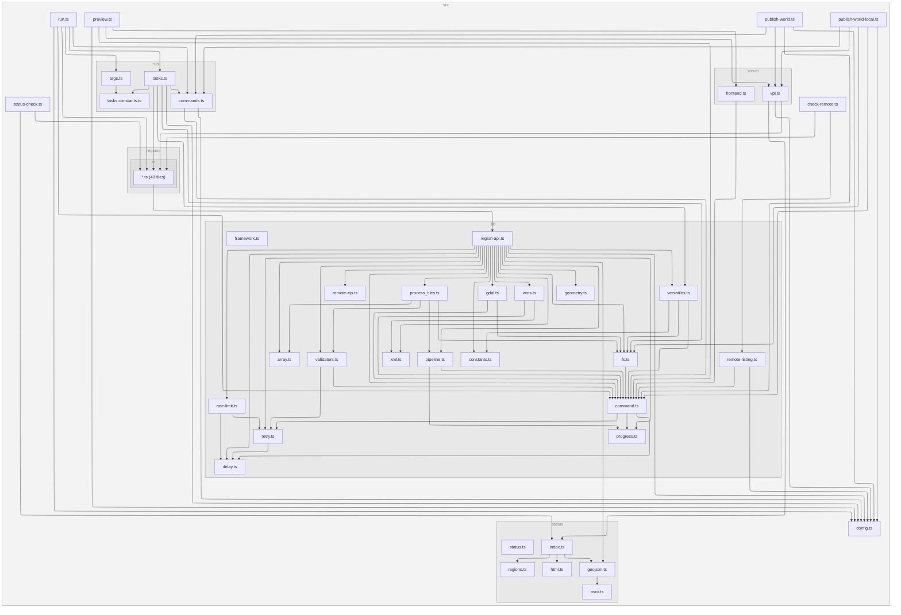

[](https://app.codecov.io/github/versatiles-org/orthophotos)
[](https://github.com/versatiles-org/orthophotos/actions/workflows/ci.yml)

# Orthophotos

This repository contains scripts and tools to fetch, process, and serve raster tiles generated from orthophotos. It provides automated workflows for downloading raw orthophoto data from European national agencies, processing it into `*.versatiles` containers, and preparing a server to preview them.

## Contents

- **`/src/regions/`**: TypeScript region definitions — each file defines metadata and a pipeline for fetching + converting orthophoto data.
- **`/src/`**: TypeScript source code for the pipeline, utilities, status checking, and server preparation.
- **`/web/`**: HTML and related files used to run a test server that previews all processed orthophoto data.
- **`/data/`**: NUTS TopoJSON reference data for region matching.

## Setup

### Prerequisites

- Node.js >= 22
- External CLI tools: `7z`, `curl`, `gdal_translate`, `gdalbuildvrt`, `ssh`, `unzip`, `versatiles`

Install CLI dependencies (macOS or Linux):

```bash
./install-dependencies.sh
```

Install Node.js dependencies:

```bash
npm install
```

### Configuration

Create a `config.env` file:

```bash
dir_data=/mnt/volume/        # Directory for storing large datasets and final outputs
dir_temp=/root/temp/          # Directory used for temporary files during processing
ssh_host=your.ssh.host        # Hostname for remote storage
ssh_port=22                   # SSH port
ssh_id=/root/.ssh/id           # Path to SSH private key
ssh_dir=/path/to/remote/data   # Remote base directory for uploads
```

## Running the Pipeline

```bash
./run.sh <region> <task>
```

### Tasks

| #   | Name   | Description                                            |
| --- | ------ | ------------------------------------------------------ |
| 1   | fetch  | Download source data + per-file versatiles mosaic tile |
| 2   | merge  | Merge .versatiles files + upload to remote             |
| 3   | delete | Remove local data and temp directories                 |

Task spec supports: numbers (`2`), names (`fetch`), ranges (`1-3`), comma lists (`fetch,2-3`), `all` (full pipeline).

### Examples

```bash
./run.sh de/berlin 1         # Fetch orthophoto data for Berlin
./run.sh de/berlin 1-2       # Fetch and merge
./run.sh de/berlin all       # Full pipeline: fetch, merge, delete
```

## Preview Server

The preview server shows all processed orthophoto data using VersaTiles. It generates a `.vpl` (VersaTiles Pipeline Language) file that references orthophoto and satellite containers via SFTP, with GeoJSON masks for clean region clipping.

```bash
npm run server
```

The demo is publicly accessible at [versatiles.org/satellite_demo/](https://versatiles.org/satellite_demo/).

## Development

```bash
npm run check          # Lint + format check + typecheck + tests
npm run lint           # ESLint
npm run test           # Run tests (vitest)
npm run test:coverage  # Run tests with coverage
npm run typecheck      # TypeScript type checking
npm run format         # Auto-format with Prettier
```

### Dependency Graph

<!--- This chapter is generated automatically --->



## Notes

Also check the [EU/EC INSPIRE Geoportal](https://inspire-geoportal.ec.europa.eu/srv/eng/catalog.search#/overview?view=themeOverview&theme=oi) for more data sources.
